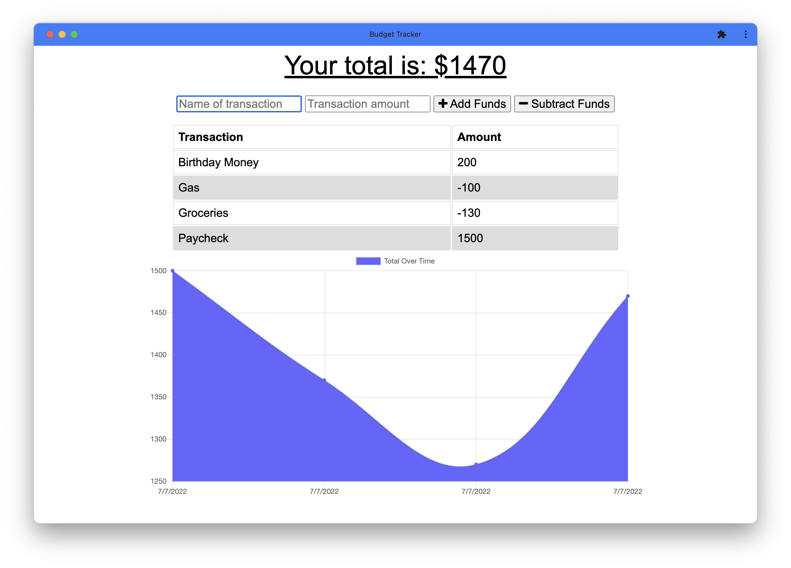

# Budget Tracker PWA


## Description

This project is a full-stack progressive web application that allows users to track their budget. The main purpose of the project is to turn an existing application into a progressive web application. The application includes a Web Manifest and is installable with offline capabilities that use Service Workers and IndexedDB.
<br>

## Table of Contents

- [Installation](#installation)
- [Usage](#usage)
- [Deployed Link](#deployed-link)
- [License](#license)
- [Questions](#questions)  
  <br>

## Installation

Use the following command to download dependencies for the project:

```
npm install
```

  <br>

## Usage


</br>
The application can be installed onto a computer or mobile devices. Users can enter in a transaction name and amount to be either added or subtracted. A line item for the transaction is created, and a graph of the transactions is populated. The application works offline, and all offline transactions are added to the database once the application comes back online.

<br>

## Deployed Link

[Budget Tracker App](https://dry-tundra-90239.herokuapp.com/)
</br>

## License

This project is licensed under the [MIT License](https://choosealicense.com/licenses/mit/).  
 </br>

## Questions

[GitHub](https://github.com/dneflas)
